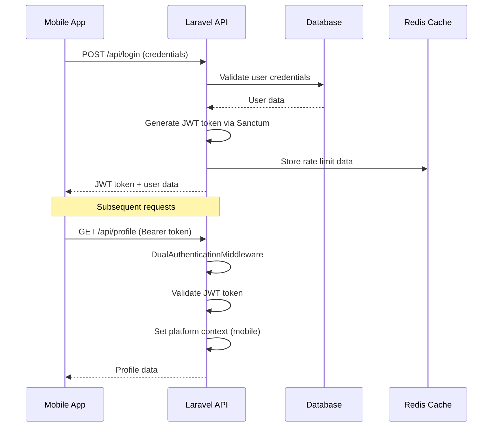
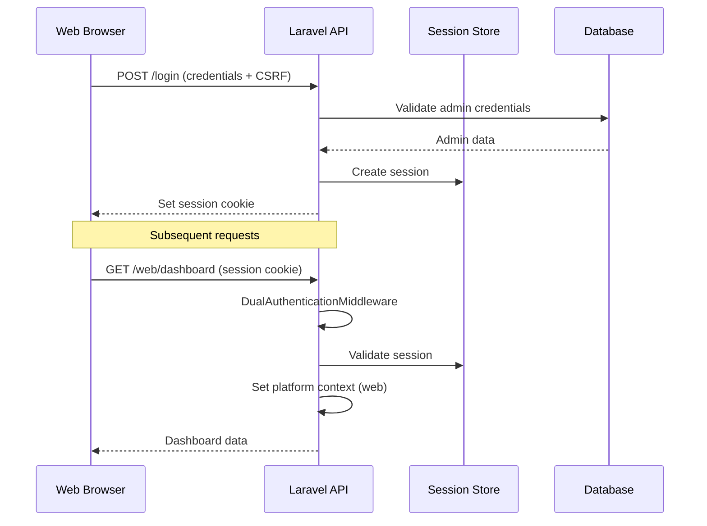

# Authentication Troubleshooting Guide

## Overview

This comprehensive guide provides debugging tools, troubleshooting steps, and solutions for authentication issues in the Astacala Rescue Mobile cross-platform system.

## Table of Contents

1. [Authentication Architecture Overview](#authentication-architecture-overview)
2. [Platform-Specific Authentication Flows](#platform-specific-authentication-flows)
3. [Common Authentication Issues](#common-authentication-issues)
4. [Debugging Tools and Techniques](#debugging-tools-and-techniques)
5. [Network Condition Testing](#network-condition-testing)
6. [Performance Troubleshooting](#performance-troubleshooting)
7. [Security Incident Response](#security-incident-response)
8. [API Endpoint Testing](#api-endpoint-testing)

## Authentication Architecture Overview

### Dual Authentication System

The system supports two distinct authentication methods:

```php
// Mobile Authentication (JWT)
Route::middleware('dual.auth')->group(function () {
    // Mobile routes use JWT tokens via Sanctum
    Route::get('/mobile/profile', [MobileController::class, 'profile']);
});

// Web Authentication (Session)
Route::middleware('dual.auth')->group(function () {
    // Web routes use Laravel session authentication
    Route::get('/web/dashboard', [WebController::class, 'dashboard']);
});
```

### Middleware Stack

1. **DualAuthenticationMiddleware**: Handles both JWT and session authentication
2. **UserContextService**: Manages platform-specific permissions
3. **CrossPlatformRateLimitMiddleware**: Platform-aware rate limiting
4. **ApiRequestLoggingMiddleware**: Comprehensive request logging

## Platform-Specific Authentication Flows

### Mobile Authentication Flow



### Web Authentication Flow



## Common Authentication Issues

### 1. JWT Token Issues

#### **Issue**: Invalid or Expired JWT Token
```json
{
    "error": "Unauthenticated",
    "message": "Invalid or expired token",
    "code": "AUTH_INVALID_TOKEN"
}
```

**Debugging Steps**:
1. Check token format and structure
2. Verify token expiration time
3. Validate token signature
4. Check if user still exists

**Solution**:
```php
// Check token in tinker
php artisan tinker
>>> $token = "your-jwt-token-here";
>>> $user = \Laravel\Sanctum\PersonalAccessToken::findToken($token);
>>> $user ? $user->tokenable : "Token not found";
```

#### **Issue**: Token Not Being Sent
```bash
# Check request headers
curl -H "Authorization: Bearer YOUR_TOKEN" \
     -H "Content-Type: application/json" \
     -X GET http://localhost:8000/api/profile
```

### 2. Session Authentication Issues

#### **Issue**: Session Not Found or Expired
```json
{
    "error": "Unauthenticated", 
    "message": "Session expired or not found",
    "code": "AUTH_SESSION_INVALID"
}
```

**Debugging Steps**:
1. Check session configuration
2. Verify CSRF token
3. Check session storage
4. Validate cookie settings

**Solution**:
```php
// Check session in browser dev tools
// Application > Storage > Cookies
// Look for laravel_session cookie

// Check session data in tinker
php artisan tinker
>>> session()->all();
>>> auth()->check();
>>> auth()->user();
```

### 3. Rate Limiting Issues

#### **Issue**: Too Many Requests
```json
{
    "error": "Too Many Requests",
    "message": "Rate limit exceeded for mobile authentication",
    "retry_after": 900
}
```

**Debugging Steps**:
```php
// Check rate limit status in Redis
redis-cli
> KEYS "laravel_cache:rate_limit:*"
> GET "laravel_cache:rate_limit:mobile:auth:USER_ID"
```

### 4. Platform Detection Issues

#### **Issue**: Wrong Platform Context
```json
{
    "error": "Platform Mismatch",
    "message": "Mobile user trying to access web endpoint"
}
```

**Debugging Steps**:
1. Check X-Platform header
2. Verify middleware order
3. Validate platform detection logic

## Debugging Tools and Techniques

### 1. Laravel Telescope (Recommended)

Install and configure Telescope for comprehensive debugging:

```bash
composer require laravel/telescope
php artisan telescope:install
php artisan migrate
```

**Telescope Features**:
- Request/Response monitoring
- Authentication attempts tracking
- Database query analysis
- Cache operations monitoring
- Exception tracking

### 2. Custom Debug Middleware

```php
// Add to app/Http/Middleware/AuthDebugMiddleware.php
<?php

namespace App\Http\Middleware;

use Closure;
use Illuminate\Http\Request;
use Illuminate\Support\Facades\Log;

class AuthDebugMiddleware
{
    public function handle(Request $request, Closure $next)
    {
        $debugInfo = [
            'timestamp' => now()->toISOString(),
            'url' => $request->fullUrl(),
            'method' => $request->method(),
            'headers' => $this->getAuthHeaders($request),
            'user_agent' => $request->userAgent(),
            'ip' => $request->ip(),
            'auth_guard' => auth()->getDefaultDriver(),
            'authenticated' => auth()->check(),
            'user_id' => auth()->id(),
            'platform' => $request->get('platform', 'unknown'),
        ];

        Log::channel('auth_debug')->info('Authentication Debug', $debugInfo);
        
        $response = $next($request);
        
        Log::channel('auth_debug')->info('Authentication Response', [
            'status' => $response->getStatusCode(),
            'authenticated_after' => auth()->check(),
            'user_id_after' => auth()->id(),
        ]);

        return $response;
    }

    private function getAuthHeaders(Request $request): array
    {
        return [
            'authorization' => $request->header('Authorization') ? 'Bearer [PRESENT]' : null,
            'x_platform' => $request->header('X-Platform'),
            'content_type' => $request->header('Content-Type'),
            'accept' => $request->header('Accept'),
        ];
    }
}
```

### 3. Authentication Test Commands

Create custom Artisan commands for testing:

```php
// app/Console/Commands/TestAuthCommand.php
<?php

namespace App\Console\Commands;

use Illuminate\Console\Command;
use Illuminate\Support\Facades\Http;

class TestAuthCommand extends Command
{
    protected $signature = 'auth:test {platform} {--token=} {--email=} {--password=}';
    protected $description = 'Test authentication for specific platform';

    public function handle()
    {
        $platform = $this->argument('platform');
        
        if ($platform === 'mobile') {
            $this->testMobileAuth();
        } elseif ($platform === 'web') {
            $this->testWebAuth();
        } else {
            $this->error('Platform must be either "mobile" or "web"');
        }
    }

    private function testMobileAuth()
    {
        $token = $this->option('token');
        $email = $this->option('email');
        $password = $this->option('password');

        if (!$token && (!$email || !$password)) {
            $this->error('Either --token or both --email and --password required');
            return;
        }

        $baseUrl = config('app.url');

        if (!$token) {
            // Test login
            $this->info('Testing mobile login...');
            $response = Http::post("{$baseUrl}/api/login", [
                'email' => $email,
                'password' => $password,
                'platform' => 'mobile'
            ]);

            if ($response->successful()) {
                $data = $response->json();
                $token = $data['data']['tokens']['access_token'];
                $this->info("Login successful. Token: {$token}");
            } else {
                $this->error("Login failed: " . $response->body());
                return;
            }
        }

        // Test authenticated endpoint
        $this->info('Testing authenticated mobile endpoint...');
        $response = Http::withHeaders([
            'Authorization' => "Bearer {$token}",
            'X-Platform' => 'mobile',
            'Accept' => 'application/json'
        ])->get("{$baseUrl}/api/profile");

        if ($response->successful()) {
            $this->info("Authenticated request successful");
            $this->line(json_encode($response->json(), JSON_PRETTY_PRINT));
        } else {
            $this->error("Authenticated request failed: " . $response->body());
        }
    }

    private function testWebAuth()
    {
        $this->info('Testing web authentication requires browser session');
        $this->info('Use browser dev tools or Postman for web auth testing');
    }
}
```

### 4. Database Query Debugging

Monitor authentication-related queries:

```php
// Add to AppServiceProvider boot method
DB::listen(function ($query) {
    if (str_contains($query->sql, 'personal_access_tokens') || 
        str_contains($query->sql, 'sessions') ||
        str_contains($query->sql, 'users')) {
        
        Log::channel('db_auth')->info('Auth Query', [
            'sql' => $query->sql,
            'bindings' => $query->bindings,
            'time' => $query->time
        ]);
    }
});
```

## Network Condition Testing

### 1. Slow Network Simulation

Test authentication under poor network conditions:

```bash
# Using tc (Linux/WSL)
sudo tc qdisc add dev eth0 root netem delay 1000ms

# Test mobile login with delay
curl -w "@curl-format.txt" \
     -H "Content-Type: application/json" \
     -d '{"email":"test@example.com","password":"password"}' \
     -X POST http://localhost:8000/api/login

# Remove delay
sudo tc qdisc del dev eth0 root
```

### 2. Connection Timeout Testing

```php
// Test timeout handling
$response = Http::timeout(5)->post('http://localhost:8000/api/login', [
    'email' => 'test@example.com',
    'password' => 'password'
]);
```

### 3. Intermittent Connection Testing

Create a test that simulates connection drops:

```php
// app/Console/Commands/NetworkTestCommand.php
public function handle()
{
    for ($i = 0; $i < 10; $i++) {
        try {
            $response = Http::timeout(2)->post($this->baseUrl . '/api/login', [
                'email' => 'test@example.com',
                'password' => 'password'
            ]);
            
            $this->info("Attempt {$i}: " . $response->status());
        } catch (\Exception $e) {
            $this->error("Attempt {$i}: " . $e->getMessage());
        }
        
        sleep(1);
    }
}
```

## Performance Troubleshooting

### 1. Authentication Performance Monitoring

```php
// Add to middleware to track auth performance
class AuthPerformanceMiddleware
{
    public function handle(Request $request, Closure $next)
    {
        $startTime = microtime(true);
        
        $response = $next($request);
        
        $executionTime = (microtime(true) - $startTime) * 1000;
        
        if ($executionTime > 1000) { // Log slow auth requests
            Log::warning('Slow Authentication', [
                'url' => $request->fullUrl(),
                'execution_time_ms' => $executionTime,
                'user_id' => auth()->id(),
                'memory_usage' => memory_get_peak_usage(true)
            ]);
        }
        
        return $response;
    }
}
```

### 2. Database Connection Monitoring

```php
// Monitor auth-related database performance
class AuthDatabaseMonitor
{
    public static function logSlowQueries()
    {
        DB::whenQueryingForLongerThan(500, function ($connection, $event) {
            Log::warning('Slow Auth Query', [
                'connection' => $connection->getName(),
                'sql' => $event->sql,
                'time' => $event->time
            ]);
        });
    }
}
```

## Security Incident Response

### 1. Suspicious Authentication Activity

Monitor for unusual patterns:

```php
// Check for multiple failed attempts
$failedAttempts = Cache::get("failed_attempts:" . $request->ip(), 0);

if ($failedAttempts > 5) {
    Log::alert('Multiple Failed Authentication Attempts', [
        'ip' => $request->ip(),
        'user_agent' => $request->userAgent(),
        'attempts' => $failedAttempts,
        'timestamp' => now()
    ]);
}
```

### 2. Token Abuse Detection

```php
// Monitor token usage patterns
class TokenAbuseDetector
{
    public function checkTokenUsage($token, $request)
    {
        $key = "token_usage:" . hash('sha256', $token);
        $usage = Cache::get($key, []);
        
        $usage[] = [
            'ip' => $request->ip(),
            'user_agent' => $request->userAgent(),
            'timestamp' => now(),
            'endpoint' => $request->path()
        ];
        
        // Keep last 100 requests
        $usage = array_slice($usage, -100);
        Cache::put($key, $usage, 3600);
        
        // Check for suspicious patterns
        $uniqueIPs = count(array_unique(array_column($usage, 'ip')));
        $requestCount = count($usage);
        
        if ($requestCount > 50 && $uniqueIPs > 10) {
            Log::alert('Suspicious Token Usage', [
                'token_hash' => hash('sha256', $token),
                'unique_ips' => $uniqueIPs,
                'request_count' => $requestCount,
                'recent_usage' => array_slice($usage, -5)
            ]);
        }
    }
}
```

## API Endpoint Testing

### 1. Comprehensive Auth Test Suite

```bash
#!/bin/bash
# auth_test_suite.sh

BASE_URL="http://localhost:8000"

echo "Testing Mobile Authentication Flow..."

# Test mobile registration
echo "1. Testing mobile registration"
REGISTER_RESPONSE=$(curl -s -X POST "${BASE_URL}/api/register" \
  -H "Content-Type: application/json" \
  -H "X-Platform: mobile" \
  -d '{
    "name": "Test User",
    "email": "test@example.com", 
    "password": "password123",
    "password_confirmation": "password123"
  }')

echo "Registration Response: $REGISTER_RESPONSE"

# Test mobile login
echo "2. Testing mobile login"
LOGIN_RESPONSE=$(curl -s -X POST "${BASE_URL}/api/login" \
  -H "Content-Type: application/json" \
  -H "X-Platform: mobile" \
  -d '{
    "email": "test@example.com",
    "password": "password123"
  }')

echo "Login Response: $LOGIN_RESPONSE"

# Extract token
TOKEN=$(echo $LOGIN_RESPONSE | jq -r '.data.tokens.access_token // empty')

if [ -n "$TOKEN" ]; then
  echo "Token extracted: $TOKEN"
  
  # Test authenticated endpoint
  echo "3. Testing authenticated mobile endpoint"
  PROFILE_RESPONSE=$(curl -s -X GET "${BASE_URL}/api/profile" \
    -H "Authorization: Bearer $TOKEN" \
    -H "X-Platform: mobile" \
    -H "Accept: application/json")
  
  echo "Profile Response: $PROFILE_RESPONSE"
  
  # Test logout
  echo "4. Testing mobile logout"
  LOGOUT_RESPONSE=$(curl -s -X POST "${BASE_URL}/api/logout" \
    -H "Authorization: Bearer $TOKEN" \
    -H "X-Platform: mobile" \
    -H "Accept: application/json")
  
  echo "Logout Response: $LOGOUT_RESPONSE"
else
  echo "Failed to extract token from login response"
fi

echo "Authentication test complete"
```

### 2. Load Testing Authentication

```bash
# auth_load_test.sh
#!/bin/bash

echo "Running authentication load test..."

# Test concurrent logins
for i in {1..50}; do
  {
    curl -s -X POST "http://localhost:8000/api/login" \
      -H "Content-Type: application/json" \
      -d "{
        \"email\": \"user${i}@example.com\",
        \"password\": \"password123\"
      }" > /dev/null
    echo "Login attempt $i completed"
  } &
done

wait
echo "Load test completed"
```

## Configuration Validation

### 1. Environment Check

```php
// app/Console/Commands/AuthConfigCheckCommand.php
class AuthConfigCheckCommand extends Command
{
    protected $signature = 'auth:check-config';
    
    public function handle()
    {
        $this->info('Checking authentication configuration...');
        
        // Check Sanctum config
        $this->checkSanctumConfig();
        
        // Check session config
        $this->checkSessionConfig();
        
        // Check cache config
        $this->checkCacheConfig();
        
        // Check middleware registration
        $this->checkMiddlewareConfig();
    }
    
    private function checkSanctumConfig()
    {
        $driver = config('auth.guards.sanctum.driver');
        $provider = config('auth.guards.sanctum.provider');
        
        if ($driver !== 'sanctum') {
            $this->error('Sanctum guard driver not configured correctly');
        } else {
            $this->info('✓ Sanctum guard configured');
        }
        
        if (!$provider) {
            $this->error('Sanctum provider not configured');
        } else {
            $this->info("✓ Sanctum provider: {$provider}");
        }
    }
    
    private function checkSessionConfig()
    {
        $driver = config('session.driver');
        $lifetime = config('session.lifetime');
        
        $this->info("✓ Session driver: {$driver}");
        $this->info("✓ Session lifetime: {$lifetime} minutes");
        
        if ($driver === 'redis' && !extension_loaded('redis')) {
            $this->error('Redis extension not loaded but Redis session driver configured');
        }
    }
}
```

## Troubleshooting Checklist

### Pre-Authentication Checks
- [ ] Environment variables configured correctly
- [ ] Database connection working
- [ ] Cache system accessible (Redis/Memcached)
- [ ] Sanctum tables migrated
- [ ] CORS configuration allows requests
- [ ] SSL/TLS certificates valid (production)

### Mobile Authentication Checks
- [ ] JWT token format valid
- [ ] Token not expired
- [ ] User record exists in database
- [ ] Bearer token in Authorization header
- [ ] X-Platform header set to 'mobile'
- [ ] Rate limiting not exceeded

### Web Authentication Checks
- [ ] Session cookies enabled in browser
- [ ] CSRF token included in requests
- [ ] Session store accessible
- [ ] Admin user record exists
- [ ] X-Platform header set to 'web'
- [ ] Same-origin policy respected

### Performance Checks
- [ ] Database queries optimized
- [ ] Cache hit rates acceptable
- [ ] Memory usage within limits
- [ ] Response times under thresholds
- [ ] No N+1 query problems

### Security Checks
- [ ] Rate limiting active
- [ ] Request logging enabled
- [ ] Suspicious activity monitoring working
- [ ] Failed attempt tracking operational
- [ ] Token abuse detection active

This troubleshooting guide provides comprehensive coverage for diagnosing and resolving authentication issues in the cross-platform system. Use the debugging tools and techniques to quickly identify and resolve problems.
